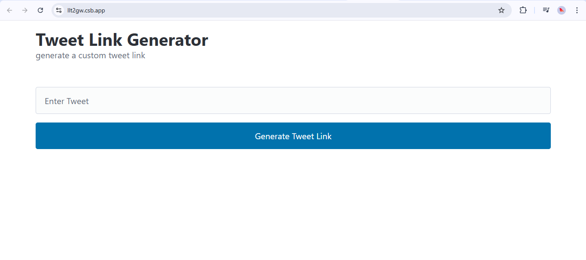

# Tweetify – Tweet Link Generator

Easily generate a direct Twitter (now X) link to share a tweet from any message with this simple web tool. Tweetify lets you create a tweet intent link (`https://twitter.com/intent/tweet?text=...`) for sharing on X/Twitter instantly.

---

## 🌐 Demo

Try it online: [https://tweet-ify.netlify.app/](https://tweetify-v1.netlify.app/)

Or, you can run it locally by opening `index.html` in your browser.

---

## 📁 Project Structure

```
Tweetify/
├── index.html                  # Main HTML structure and UI
├── assets/
│   ├── css/
│   │   └── main.css            # Styles for layout and responsiveness
│   ├── img/
│   │   └── screenshot-tweetify.png   # Project screenshot
│   └── js/
│       └── main.js             # JavaScript logic for Tweetify
├── README.md                   # Project documentation
├── License.md                  # License file (MIT)
├── .gitignore                  # Git ignored files
```

---

## 🚀 Features

- ✅ Enter your tweet message and generate an instant Tweet intent link.
- ✅ Copy the generated link and share it anywhere.
- ✅ Built with HTML, CSS, and JavaScript (no frameworks!).
- ✅ Clean, responsive UI using [Pico CSS](https://picocss.com/).
- ✅ Works entirely offline – just open `index.html`.

---

## 📸 Screenshot



---

## 🔧 Usage

1. Open the [online demo](https://tweet-ify.netlify.app/) **or** open `index.html` locally in your browser.
2. Enter your tweet message in the input field.
3. Click "Generate Tweet Link".
4. The generated tweet intent link will appear below the button.

**Example output:**

```
https://twitter.com/intent/tweet?text=Hello%20from%20Tweetify!
```

Copy and share this link anywhere to pre-fill a tweet.

---

## 🛠 Tech Stack

- HTML5
- Vanilla JavaScript
- Pico CSS (via CDN)

---

## 📦 Installation (for Developers)

Clone this repo:

```bash
git clone https://github.com/shivankushsingh09/Tweetify.git
cd Tweetify
```

Then open `index.html` in your browser.

> Note: No build tools or dependencies required.

---

## 📌 Customization

Want to enhance Tweetify? Here are some ideas:

- **Copy-to-clipboard:** Add a button to copy the generated link (update `index.html` and JavaScript).
- **Validation:** Improve input validation for tweet messages.
- **Online Hosting:** Deploy on GitHub Pages, Netlify, Vercel, etc.
- **Advanced options:** Add support for hashtags, mentions, or media URLs.

**Example function for generating the tweet intent link (from `index.html`):**
```js
function getTweetUrl(message) {
  const encodedTweet = encodeURIComponent(message);
  return "https://twitter.com/intent/tweet?text=" + encodedTweet;
}
```

---

## 🧾 License

This project is licensed under the MIT License. See [`License.md`](License.md) for details.

---

## 🙌 Contributing

Contributions, issues, and feature requests are welcome!

1. Fork the repository.
2. Create your branch (`git checkout -b feature/something`).
3. Commit your changes (`git commit -am 'Add something'`).
4. Push to your branch (`git push origin feature/something`).
5. Create a new Pull Request.

---

## 📬 Contact

For questions or suggestions, open an [issue](https://github.com/shivankushsingh09/Tweetify/issues).

---

Enjoy using **Tweetify – Tweet Link Generator**!

---

Let me know if you want this version to include:

- Copy-to-clipboard button,
- Hosting options (GitHub Pages, Netlify),
- Advanced input validation,
- Or anything else!
```
